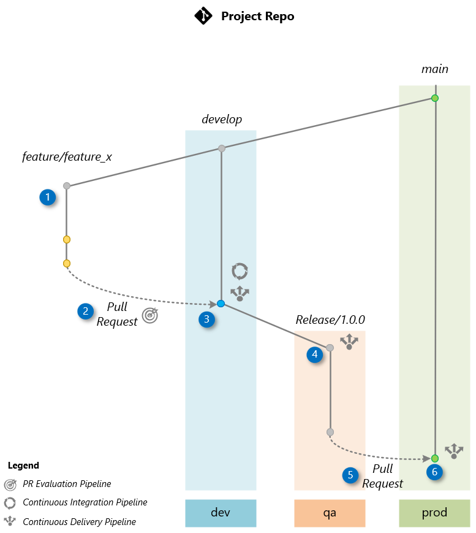

# Exercise 05: Automating Everything

## Scenario

In this exercise, you'll learn to automate the build, evaluation, and deployment of your LLM orchestration flow. We'll use the [**LLMOps Accelerator**](https://github.com/azure/llmops) as a guide for deploying an LLM with **Prompt Flow** and **GitHub Actions**. This automation is vital for Lamna Healthcare Company, enabling efficient, error-free deployment processes for their 24/7 support virtual agent.

By mastering these tasks, Lamna Healthcare Company's team will boost their ability to manage AI projects independently, ensuring smooth operations and maximizing the benefits of Azure AI services for their healthcare solutions.

## Git Workflow

The image below illustrates the workflow used in the workshop. We'll explore how to deliver a new feature based on this workflow. In this example, we are developing a feature called "Feature X," which will be included in the project's release 1.0.0.

## Detailed Workflow Description:

1. **Feature Branch Creation:**

   The process starts when the development team creates a feature branch from the `develop` branch. This branch is dedicated to the development of the new feature X.

2. **Pull Request (PR):**

   Upon completing the feature, a Pull Request (PR) is initiated from the feature branch to the `develop` branch, which is the default branch where the team integrates changes.

   The creation of the PR triggers a *PR Evaluation Pipeline* to ensure that the code adheres to standards, passes unit tests, and the orchestration flow is evaluated by AI to ensure it meets quality metrics.

3. **Merge to develop:**

   Once the Pull Request is approved, it is merged into the `develop` branch. This merge triggers the *Continuous Integration (CI) Pipeline*, which builds the orchestration flow and conducts AI-assisted evaluations using a comprehensive test dataset based on the [Golden Dataset](https://aka.ms/copilot-golden-dataset-guide). Upon successful completion, the *Continuous Deployment (CD) Pipeline* is executed to deploy the flow to the **dev** environment.

4. **Release Branch Creation (Release/1.0.0):**

   After confirming the stability of the `develop` branch through testing in **dev**, a release branch is created from `develop`. This triggers a *Continuous Deployment (CD) Pipeline* to deploy the application to the **qa** environment. Before deployment, an AI-based evaluation assesses [quality](https://learn.microsoft.com/en-us/azure/ai-studio/how-to/develop/flow-evaluate-sdk), risk, and [safety](https://learn.microsoft.com/en-us/azure/ai-studio/how-to/develop/simulator-interaction-data) factors. The application in **qa** is then used for User Acceptance Testing (UAT) and [red-teaming](https://learn.microsoft.com/en-us/azure/ai-services/openai/concepts/red-teaming) or LLM App.

5. **Pull Request to main:**

   After UAT tests in the **qa** environment confirm that the application is ready for production, a Pull Request (PR) is created to merge the changes into the `main` branch.

6. **Merge to main:**

   Once the Pull Request (PR) to the `main` branch is manually approved, the release branch is merged into the `main` branch. This action triggers the Continuous Deployment (CD) Pipeline, which deploys the code to the **prod** environment.

## CI/CD Pipelines

The CI/CD (Continuous Integration/Continuous Deployment) pipelines automate integration, evaluation, and deployment processes, ensuring efficient delivery of high-quality applications.

- **The Pull Request Evaluation Pipeline** begins with unit tests, followed by a code review, and concludes with AI-assisted prompt evaluation to validate code changes before integration.

- **The Continuous Integration Pipeline** starts with unit tests and code reviews, followed by AI-assisted flow evaluation to identify potential issues. The application is then built, and the flow image is registered for deployment.

- **The Continuous Deployment Pipeline** operates across three environments: dev, qa, and prod. Provisioning of resources is performed when necessary, and the deployment of the application is executed in the respective environment.

  - **In the dev environment**, the latest code is pulled, and the application is deployed for the development team's testing.

  - **In the qa environment**, the code is retrieved, and AI-assisted evaluations for quality and safety are conducted, followed by integration testing. The application is then deployed and made available for User Acceptance Testing (UAT).

  - **In the prod environment**, the same image built in the Continuous Integration Pipeline is deployed, ensuring consistency and reliability. Integration testing is conducted, and smoke testing ensures functionality post-deployment.

This structured approach streamlines workflows, reduces errors, and guarantees the efficient delivery of applications to production.

## Objectives

After you complete this exercise, you will be able to:

- Discuss further the topics of this exercise
- Create a project and associate resources without instruction

## Lab Duration

- **Estimated Time:** 120 minutes